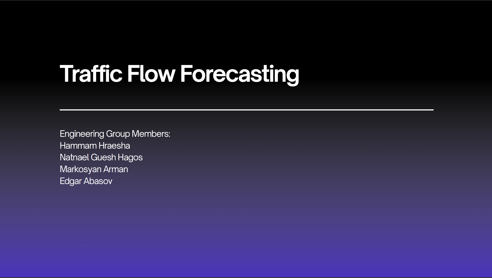

# Traffic Flow Forecasting

## Repository Link

[https://github.com/Metaphysicist1/Enginering-Project]

## Description

Our project aims to forecast traffic flow using time series data. We examine various models from different classes and purposes to determine the most effective approach for accurate predictions.

### Task Type

Regression

### Results Summary

- **Best Model:** ASTGCN
- **Evaluation Metric:** MSE (Mean Squared Error) and RMSE (Root Mean Squared Error)
- **Result:**
  - MSE: **14.6%**  
  - RMSE: **15.15%**

## Cover Image

